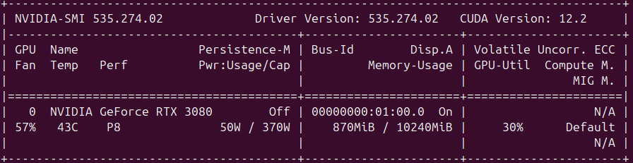

# Modular Memory-augmented Models (MoMeM)
> [!NOTE]
> The models used were trained from scratch with very limited datasets and very small parameter sizes. They are not state-of-the-art chatbots like those made by ~~multi-billion~~ trillion dollar companies. Also finetuning open-sourced pretrained models was not an option due to limited VRAM on my GPU and me needing a challenge ("What I cannot build. I do not understand.", Richard Feynman). The only tests performed after training was checking to see how the model(s) handled new data i.e those held out during training. Kindly view this project as simply a proof of concept for an idea and nothing more.
 
## Description
This project demonstrates, in practice, the concepts outlined in the <a href="/docs/(WIP) Technical Design Document v4.pdf" type="application/pdf">(WIP) Techinical Design Document</a>. It is a <strong>proof of concept (POC)</strong> for a modular system comprising multiple Transformer models and an Information Retrieval (IR) system that acts as a form of memory (Not explicitly implemented in the code). Each of these component specializes in narrowly-scoped task, that include:
* [Named-Entity Recognition (NER)](https://www.ibm.com/think/topics/named-entity-recognition)
* [Summarization](https://www.ibm.com/think/topics/text-summarization)
* [Text Generation](https://www.ibm.com/think/topics/text-generation).

The principle idea for this project is to combine various Machine Learning (ML) concepts as well as borrow heavily from software design principles and philosophies to form modular memory-augmented models (MoMeM):
* [Unix Philosophy](http://www.catb.org/~esr/writings/taoup/html/ch01s06.html)
* [Transformer-based Models](https://doi.org/10.48550/arXiv.1706.03762)
* [Memory-Augmented Neural Networks (MANN)](https://doi.org/10.48550/arXiv.2312.06141)
* [Retrieval Augmented Generation (RAG)](https://doi.org/10.48550/arXiv.2405.06211)
* [Case-Based Reasoning (CBR)](https://doi.org/10.1007/BF00155578)
* [Information Retrieval (IR) system](https://ciir.cs.umass.edu/irbook/)

## How it works
The project relies on a synthetically generated toy dataset, constructed from a collection of sentences templates that are randomly selected and populated with variable inputs. Each generated record is structured as follows:
* **Content**: This contains a variety of details about a fictional person separated with a semicolon (;). Details of the person include the individual's names, their occupation, where they live, favourite movie, favourite music, hobbies, and the university they attended.
* **Context**: This contains:
    * **Prompt**: Specifies the exact query to emulate a possible user input request.
    * **Response**: This includes numerous potential responses to a given prompt.
    * **Summary**: This contains a text snippet from the **Content** relevant to the prompt.

Theoretically the system incorporates four modules:
* **Module<sub>0</sub>**: This module contains a **Decoder-only Transformer-based model** whose sole task is to perform **Named-Entity Recognition (NER)** on any given prompt. For example given a prompt, the model will try and identify some predefined categories of objects from the text like people's name in this project. This act as a form of [Tag](https://en.wikipedia.org/wiki/Tag_(metadata)) for the next module.
* **Module<sub>1</sub>**: This module contains a database (Memory) that stores a Key-Value pairs (**Tag**: **Content**) of data. It's main role in the overall system is to store all the relevant data in the form of **Content**, search, and filter information based on the **Tag** from **Module<sub>0</sub>**.
> [!NOTE]
> This module is **NOT EXPLICITLY** implemented in the project's code but it's theoretically a key component in the overall system.
* **Module<sub>2</sub>**: This module contains an **Encoder-Decoder Transformer-based model** whose sole task is to **Summarize** the **Content** provided from **Module<sub>1</sub>**.
* **Module<sub>3</sub>**: This module contains an **Encoder-Decoder Transformer-based model** whose purpose is to perform the **Text Generation** process by producing coherent and accurate responses to the prompt based on the **Summarized** information from **Module<sub>2</sub>**.

## Conceptual overview of the system
<p align="center">
  
</p>

## Implementation
The project includes the following:
* Code to generate the synthetic toy dataset.
* Code to generate the token vocabulary.
* Code to generate text from saved pre-trained models.
* Code to train all the models in their respective modules.

## Requirements
* Anaconda (Optional)
* Python 3

## Installing.
1. (Optional) Install [Anaconda](https://docs.anaconda.com/) on your machine.
    * Create anaconda environment:
    ```
    conda create --name <env_name> python=3.12
    ```
    * To activate anaconda environment, if not already activated:
    ```
    conda activate <env_name>
    ```
2. (If not installed) Install [Pytorch 2.5](https://pytorch.org/get-started/locally/) based on your hardware requirements and preferences.

## Generating Dataset.
To generate the synthetic dataset:
* Generate JSON vocabulary file (adjust accordingly)
```
python Scripts/generate_vocabulary.py --dest-path <Destination output path for dataset json> --lists-path <File path to CSV Lists> --template-path <File path to JSON Template>
```

* Generate JSON Training and Testing text dataset file(s) (adjust accordingly).
```
python Scripts/generate_text_dataset.py --dest-path <Destination output path for dataset json> --lists-path <File path to CSV Lists> --template-path <File path to JSON Template> --context-window <Context window (Character-Based Tokens)> --num-datapoints <Size of dataset in terms of records> --prob-threshold <Probability threshold used to augment dataset with shuffled characters.>
```

* Generate Training and Testing token datasets file(s) (adjust accordingly).
```
python Scripts/generate_token_dataset.py --dest-path <Destination output path for dataset json> --vocabulary-path <File path to generated Vocabulary> --text-dataset-path <File path to generated text Dataset>
```

## Creating JSON config file.
Before a model can be trained, you will be required to generate a config file (**config.json**) containing information about the model parameters and other information such as *learning rate*. Config file example (adjust accordingly):
```
{
    "model_lr": 1e-4,
    "num_heads": 32,
    "embedding_dim": 512,
    "hidden_dim": 2048,
    "context_window": 256,
    "activation_type": "gelu",
    "max_global_steps": 100000,
    "lr_gamma": 0.5,
    "num_encoder_blocks": 3,
    "num_decoder_blocks": 4
}
```

## Training models.
To train the model(s) using the generated dataset and config file, run the following (adjust accordingly):
```
python train_Transformer_models.py --device <Which hardware device will model run on> --temperature <Temperature parameter for softmax sampling> --model-type <Model to be trained>  --vocabulary-path <File path to vocabulary> --tr-dataset-path <File path to training json dataset file> --tst-dataset-path <File path to testing json dataset file> --batch-size <Batch size of dataset> --checkpoint-steps <Steps for checkpointing and/or testing model> --config-path <File path to JSON config file> --out-dir <Folder path of output directory> --model-checkpoint <File path to model checkpoint to load from (if any)> --lr-steps <Global steps in between halving learning rate> --load-optim <Optional flag to load pre-trained model's optimizer>
```

## Generating Text from Pre-trained models.
To generate text from each pre-trained models run the following (adjust accordingly):
```
python test_text_generation.py --device <Which hardware device will model run on> --temperature <Temperature parameter for softmax sampling> --vocabulary-path <File path to vocabulary> --tst-dataset-path <File path to testing json dataset file> --model-0-checkpoint <File path to model_0 model's checkpoint> --model-1-checkpoint <File path to model_1 model's checkpoint> --model-2-checkpoint <File path to model_2 model's checkpoint> --test-data-path <File path to JSON data> --template-path <File path to JSON Template>
```
> [!NOTE]
> Edit ```test_data.json``` file accordingly to test the system's capability on varied inputs.

## Hardware
The models were trained on a sinlge **RTX 3080 10GB** GPU. Below is a screenshot of its nvidia-smi output.

<p align="center">
  
</p>

## Pre-trained Models
The pre-trained models can be found [here](https://huggingface.co/VinML/MoMeM-POC) ("All_models.zip" - 2.42GB file). 

## Results
### Best Case (Everything functions properly)
<p align="center">
  
</p>

### Worst Case (Hallucinations and other mistakes)
<p align="center">
  
</p>

## Observations
The following was observed during training and interacting with the system:
* Due to the small size of the toy dataset and model size, the capabilities of the models is very limited. This is observable in the overall quality of the text generation output where quality **COULD** degrade when the input variables deviates from the training dataset i.e. using characters in people names that are not present in the training dataset like 'Ca$hm0ney' or using too many characters for a name.
* The models were noted to still face [hallucination](https://www.ibm.com/think/topics/ai-hallucinations). This is especially true when using data not present in the training dataset.
* During training the models, it was noted that the **Encoder-Decoder (Sequence-to-sequence)** models have a tendency to be unstable during training (The models kept crashing with a **NaN** error). This was especially true when reusing other pre-trained model weights for training e.g. training **Module<sub>3</sub>** with **Module<sub>2</sub>** model weights.

## Conclusion
This project highlights a hypothetical pipeline for the system outlined in this <a href="/docs/(WIP) Technical Design Document v4.pdf" type="application/pdf">document</a> and its viability:
* The project implementation (code) proves such a system could work **IF AND ONLY IF (IFF)** every module performs its assigned task accurately, otherwise errors could cascade through the system impacting overall performance. This could potentially be resolved by implementing quality control measures between modules to identify and correct for any mistakes that could occur.
* Hallucinations seem to be an issue that kept occuring in the generation process. This could be due to a flawed training objective or inadequate [Temperature](https://www.ibm.com/think/topics/llm-temperature) config value during the generation process. This could be remdied by training/reusing a [foundational model](https://www.ibm.com/think/topics/foundation-models) and then freezing its **Encoder** model during the [finetuning](https://www.ibm.com/think/topics/fine-tuning) phase (Only the **decoder** model has its weight adapted), much like AI image generation models like [Stable Diffusion models](https://encord.com/blog/stable-diffusion-3-text-to-image-model/).
* More research could be performed on the suggested system's capabilities and performance with bigger and better datasets and models.
